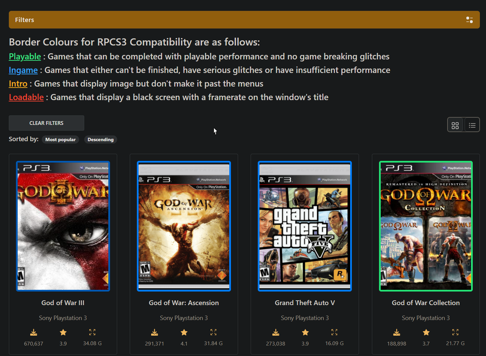
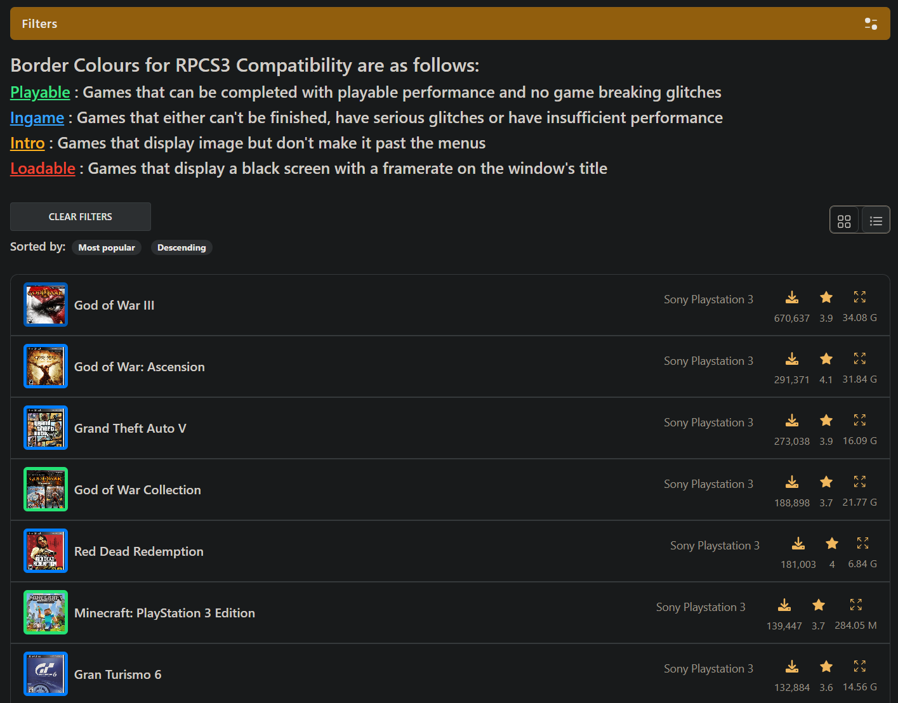
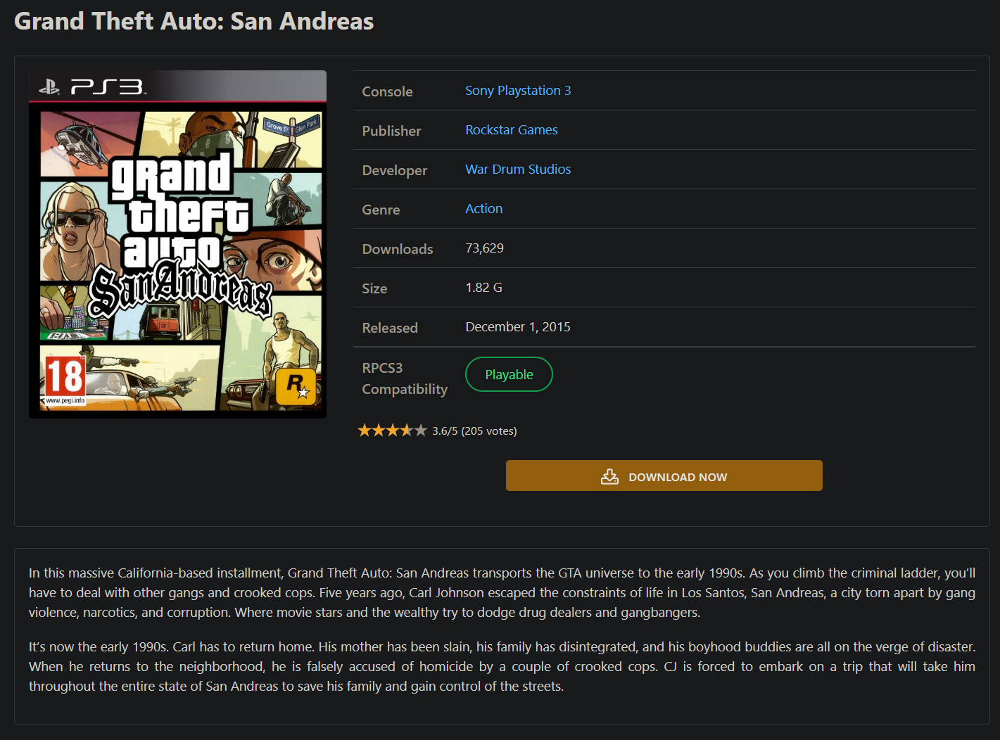

# RomsPure Scripts

Various userscripts for RomsPure to enhance various aspects of the website

<table border=2px>
<tr>
<th>RPCS3 Compatibility Checker(Search)
<th>RPCS3 Compatibility Checker(Game Page)
</tr>
<tr>
<td><a href="https://www.github.com/Satanarious/RomsPureScripts/raw/master/RPCS3CompatibilityChecker_Search.user.js">Install here</a>
<td><a href="https://www.github.com/Satanarious/RomsPureScripts/raw/master/RPCS3CompatibilityChecker_GamePage.user.js">Install here</a>
</tr>
<tr><td colspan=2></tr>
<tr>
<td>
RPCS3 compatibility checker for the search page, help you easily look at the compatibility status of the available games with the help of a border overlay.

<td>
RPCS3 compatibility checker for the game page, help you easily look at the compatibility status of the selected games with the help of a table entry as well as border overlays for `Popular Games` and `Recommended Games` sections.

</tr>
</table>
